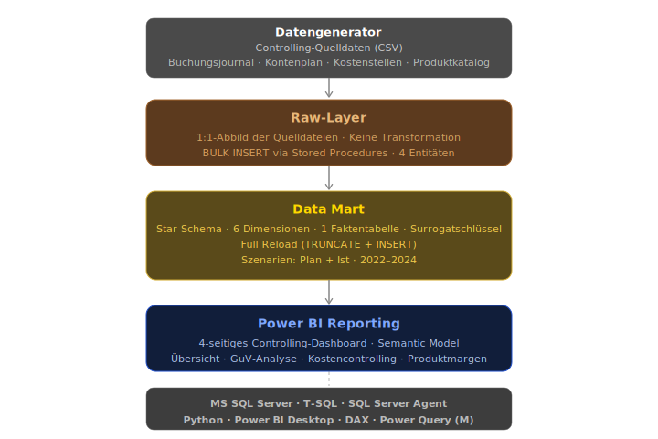
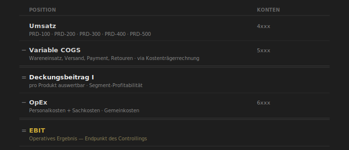
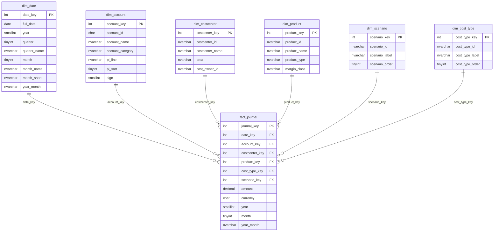
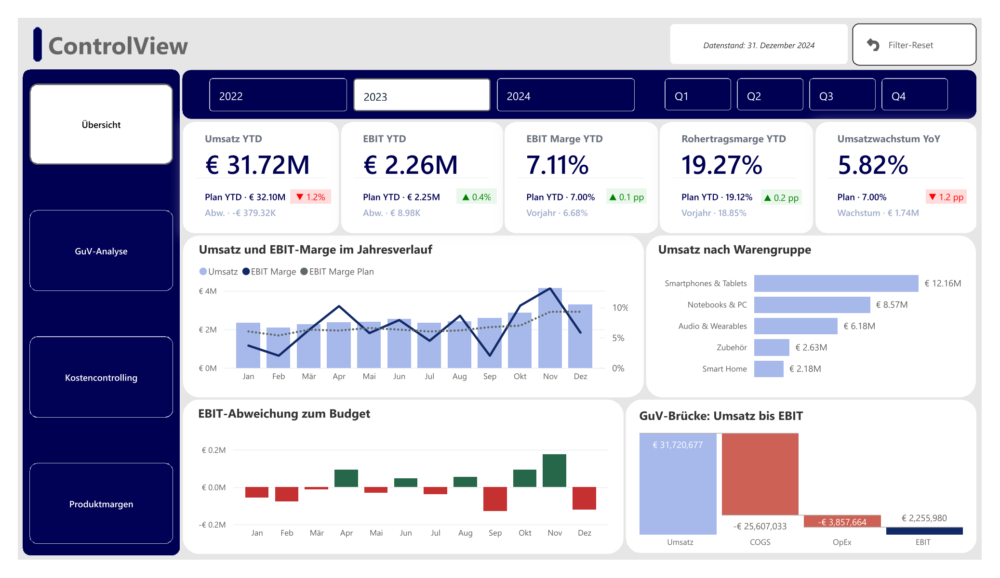

# ControlView

Controlling-Dashboard für einen modellierten mittelständischen Online-Händler: von der Rohdatengenerierung nach realen Buchhaltungsstandards über einen SQL Server Controlling Data Mart bis zum Power BI Reporting.

Modellierter Betrieb: Online-Händler für Consumer Electronics (~50 MA, ~32M EUR Umsatz, eigener Shop + Marktplätze). Das Dashboard bildet die vollständige operative GuV-Kaskade ab, von Umsatz über Deckungsbeitrag I bis EBIT, aufgeteilt auf vier Reporting-Seiten: Übersicht, GuV-Analyse, Kostencontrolling und Produktmargen.

---

## Architektur

Die Architektur folgt einem klassischen ELT-Ansatz mit drei Schichten: `raw`, `mart` und dem Power BI Semantic Model. Die Pipeline lädt die generierten Rohdaten unverändert in die `raw`-Schicht (1:1-Abbild der CSV-Quellen) und reichert sie beim Laden in die `mart`-Schicht mit Controlling-Logik an (GuV-Zuordnung inkl. Vorzeichenlogik, Kostenträgerrechnung, variable/fixe Kostenklassifizierung). Jeder Lauf baut den gesamten Datenbestand vollständig neu auf (Full Reload). Das daraus entstehende Star-Schema bildet die Datengrundlage für das Power BI Reporting, den Kern des Projekts.



---

## Unternehmenskontext

Die Produktstruktur umfasst vier Warengruppen und einen Gemeinkosten-Sammler und spiegelt eine reale Branchendynamik: Endgeräte (Smartphones, Notebooks, Smart Home) sind margenschwaches Volumengeschäft mit hohem Preisdruck durch Vergleichsportale und geringe Produktdifferenzierung. Zubehör (Eigenmarke) trägt dagegen die eigentliche Marge. Vor diesem Hintergrund ist der Deckungsbeitrag I je Warengruppe, nicht nur die GuV insgesamt, die zentrale Analyseebene des Dashboards (Seite 4: Produktmargen).

### Warengruppen

| Produkt-ID | Warengruppe | Typ | Margenklasse | Konto |
|----|-------------|-----|--------------|-------|
| PRD-100 | Smartphones & Tablets | Handelsware | Volumen | 4000 |
| PRD-200 | Notebooks & PC | Handelsware | Volumen | 4100 |
| PRD-300 | Audio & Wearables | Handelsware | Standard | 4200 |
| PRD-400 | Zubehör | Eigenmarke | Hochmarge | 4300 |
| PRD-500 | Smart Home | Handelsware | Standard | 4400 |
| PRD-900 | Gemeinkosten | Gemeinkosten | n/a | - |

### Kontenrahmen (SKR04-basiert)

Der Kontenplan folgt dem SKR04 (Standardkontenrahmen 04), dem in Deutschland gebräuchlichen Kontenrahmen für Kapitalgesellschaften. Das macht das Buchungsjournal direkt mit echten DATEV-Exporten vergleichbar: Jede Buchung trägt ein vierstelliges Konto, dessen erste Ziffer die GuV-Position bestimmt.

| Bereich | Kontenklasse | Beispiel-Konto |
|---------|--------------|----------|
| Umsatzerlöse | 4xxx | 4400: „Umsatzerlöse Smart Home" |
| Variable Kosten (COGS) | 5xxx | 5000: „Wareneinsatz Handelswaren" |
| Personal-/Sachkosten (OpEx) | 6xxx | 6000: „Gehälter Einkauf & Category Management", 6300: „Performance Marketing & Werbung" |

### GuV-Kaskade

Die Kaskade zeigt den Weg vom Umsatz zum operativen Ergebnis in zwei Stufen. Der Deckungsbeitrag I (Umsatz abzüglich variabler Kosten) ist je Warengruppe auswertbar und beantwortet die Frage, welche Warengruppe tatsächlich Geld verdient. Das EBIT (Deckungsbeitrag I abzüglich Fixkosten) ist der Endpunkt der Kaskade, weil Zinsen und Steuern von Kapitalstruktur und Rechtsform abhängen, nicht vom operativen Geschäft, und damit außerhalb des Controllings liegen.



---

## Synthetische Datenbasis

`scripts/generate_data.py` generiert vier CSV-Dateien, die DATEV-Controlling-Extrakte und Stammdaten-Exporte eines mittelständischen Online-Händlers für Consumer Electronics simulieren:

| Datei | Inhalt |
|-------|--------|
| `buchungsjournal.csv` | GL-Buchungen (Ist + Plan, 2022–2024, SKR04) |
| `kontenplan.csv` | Kontenstamm (Umsatzerlöse,variable Kosten (COGS), Personal-/Sachkosten (OpEx)) |
| `kostenstellen.csv` | Kostenstellenstamm nach Funktionsbereich |
| `produktkatalog.csv` | Warengruppenstamm mit Margenklasse |

- **Plan-Daten:** tragen bereits die erwartete Saisonkurve (Q4-lastig, Weihnachtsgeschäft; Frühjahr/Sommer schwach).
- **Ist-Daten:** weichen vom saisonalen Plan durch Erlös-/Kosten-Schwankung je Konto (±10% / ±4%) sowie einen gemeinsamen Monatsfaktor ab, der alle Konten gleichzeitig um bis zu ±5% verschiebt (simuliert monatsweite externe Einflüsse wie Nachfrageschwankungen).
- **Wachstum (Umsatz YoY):** 2023 = +7,0% / 2024 = +7,5% (jeweils ggü. Vorjahr).
- **Plan EBIT-Basis 2022:** ~7% Marge (~175k/Mo EBIT auf ~2.500k/Mo Erlöse)

---

## Data Mart: Star-Schema

Der Mart-Layer bildet das auswertungsbereite Datenmodell: ein Star Schema mit 6 Dimensionen und einer Faktentabelle, das direkt als Datenquelle für das Power BI Dashboard dient.



`fact_journal` speichert jede GL-Buchung auf Ebene Datum, Konto, Kostenstelle, Warengruppe, Kostenart und Szenario, mit dem Buchungsbetrag als zentraler Kennzahl. Alle sechs Dimensionen kurz erläutert:

- `dim_date`: Kalenderdimension (Jahr, Quartal, Monat), Basis für Zeitraumvergleiche und YTD-Berechnungen.
- `dim_account`: Kontenstamm mit GuV-Zuordnung (`pl_line`) und Vorzeichen (`sign`, +1 Erlöse / -1 Aufwand), damit Umsatz und Kosten im Modell korrekt saldiert werden.
- `dim_costcenter`: Kostenstellenstamm mit Funktionsbereich und Cost Owner, Basis für die Kostenstellenanalyse (Seite 3).
- `dim_product`: Warengruppenstamm mit Typ und Margenklasse (siehe Unternehmenskontext).
- `dim_scenario` unterscheidet Plan (Budget) von Ist (tatsächliche Buchungen). Beide Szenarien liegen in derselben Faktentabelle, wodurch Ist-Plan-Vergleiche ohne zusätzlichen Join möglich sind.
- `dim_cost_type` unterscheidet variable Kosten (einer Warengruppe direkt zurechenbar über `mart.konto_produkt_mapping`) von Fixkosten (Gemeinkosten, laufen auf PRD-900). Diese Trennung ist die Grundlage der Deckungsbeitragsrechnung.

---

## Power BI Dashboard

Vier Reporting-Seiten decken die klassischen Controlling-Perspektiven ab: Executive-Überblick mit den zentralen Gesamtkennzahlen, GuV im Detail, Kostenstellenanalyse und Produktprofitabilität.

### Seite 1: Übersicht



### Seite 2: GuV-Analyse

*In Arbeit.* Geplant: monatliche P&L-Matrix mit Ist/Plan/Abweichung je Kontozeile, gruppiert nach Umsatz, COGS und OpEx.

### Seite 3: Kostencontrolling

*In Arbeit.* Geplant: Kostenabweichung je Kostenstelle mit Zuordnung zum jeweiligen Cost Owner.

### Seite 4: Produktmargen

*In Arbeit.* Geplant: Deckungsbeitrag I je Warengruppe im Ist-Plan-Vergleich, inklusive Margenentwicklung über die Zeit.

DAX Measures: [`powerbi/te_create_measures.csx`](powerbi/te_create_measures.csx)

---

## Projektstruktur

```
ControlView/
├── docs/
│   └── images/
│       └── dashboard/
│           └── page1_uebersicht.png
├── powerbi/
│   ├── control-view_theme.json
│   └── te_create_measures.csx
├── scripts/
│   └── generate_data.py
├── sql/
│   ├── setup/
│   │   └── schemas/
│   │       └── create_schema.sql
│   ├── raw/
│   │   ├── schemas/
│   │   │   └── create_raw_tables.sql
│   │   └── procedures/
│   │       ├── raw_sp_load_buchungsjournal.sql
│   │       ├── raw_sp_load_kontenplan.sql
│   │       └── ...
│   ├── mart/
│   │   ├── schemas/
│   │   │   ├── create_mart_dims.sql
│   │   │   ├── create_mart_fact.sql
│   │   │   └── create_mart_reference.sql
│   │   └── procedures/
│   │       ├── mart_sp_load_dim_date.sql
│   │       ├── mart_sp_load_dim_account.sql
│   │       └── ...
│   ├── orchestration/
│   │   └── orchestration_sp_run_full_load.sql
│   └── views/
│       └── v_pl_monthly.sql
```

---

## Technologien

| Tool | Verwendung |
|------|------------|
| **MS SQL Server** | Data Mart, ELT-Pipeline via Stored Procedures |
| **SSMS** | DDL-Deploy, SP-Entwicklung, Testing, lokale Ausführung |
| **SQL Server Agent** | Job-Scheduling (produktive Ausführung)                   |
| **Python** | Rohdatengenerierung  |
| **Power BI Desktop** | Semantic Model, DAX Measures, Dashboard |
| **Tabular Editor 2** | Bulk-Erstellung von DAX Measures via C# Script           |
| **Git / GitHub** | Versionierung |

---

## Status

| Komponente | Status |
|------------|--------|
| Datengenerator | Abgeschlossen |
| Raw-Layer: Tabellen und Stored Procedures (je 4 Entitäten) | Abgeschlossen |
| Mart-Layer: 6 Dimensionen + fact_journal | Abgeschlossen |
| ELT-Orchestrierung | Abgeschlossen |
| Power BI Semantic Model | Abgeschlossen |
| Power BI Reporting: Seite 1: Übersicht | Abgeschlossen |
| Power BI Reporting: Seite 2: GuV-Analyse | In Arbeit |
| Power BI Reporting: Seite 3: Kostencontrolling | In Arbeit |
| Power BI Reporting: Seite 4: Produktmargen | In Arbeit |


